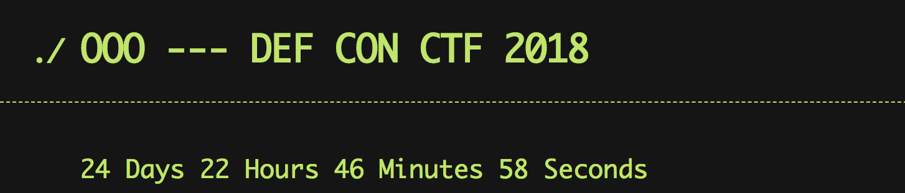

# Qualifier Scoreboard

This repository contains a number of [React](https://reactjs.org/) frontends
applications:

* countdown_frontend
* registration_frontend
* scoreboard_frontend

Additionally, the `scoreboard_backend` directory contains a
[serverless](https://serverless.com/) application for managing the server-side
components that run in AWS lambda.


Table of Contents
=================

   * [Qualifier Scoreboard](#qualifier-scoreboard)
   * [Table of Contents](#table-of-contents)
   * [Deployment Prerequisites](#deployment-prerequisites)
      * [AWS Configuration](#aws-configuration)
      * [Frontend Dependencies](#frontend-dependencies)
   * [Frontend Applications](#frontend-applications)
      * [Countdown](#countdown)
         * [Development](#development)
         * [Deployment](#deployment)
      * [Registration](#registration)
         * [Development](#development-1)
         * [Deployment](#deployment-1)
         * [Production Deployment](#production-deployment)
      * [Scoreboard](#scoreboard)
         * [Development](#development-2)
         * [Deployment](#deployment-2)
            * [Production Deployment](#production-deployment-1)
   * [scoreboard_backend](#scoreboard_backend)
      * [Development](#development-3)
      * [Setting the challenges](#setting-the-challenges)

# Deployment Prerequisites

The following are necessary in order to develop, test, and deploy the
components that make up the scoreboard.

## AWS Configuration

In order to deploy these applications, you will need a profile named `ooo` in
your `~/.aws/credentials` file containing your `aws_access_key_id` and
`aws_secret_access_key`. For more information on setting up this file see:
https://docs.aws.amazon.com/sdk-for-java/v1/developer-guide/setup-credentials.html

## Frontend Dependencies

The frontend applications are all written using React. React depends on npm and
Node.js. Install node via your favorite package manager or from
https://nodejs.org/.

Additionally, the instructions below use `yarn` as the Javascript package
manager, so you will want to install `yarn` as well. Instructions for
installing yarn can be found at https://yarnpkg.com/lang/en/docs/install/.

Once yarn is installed, to develop or deploy any of the frontend application
will first require installing the application's packages. Do that via:

```sh
cd APP_frontend
yarn install
```


# Frontend Applications

The frontend applications each build to static html, css, and javascript. The
deployed code lives in the
[oooverflow-scoreboard](https://s3.console.aws.amazon.com/s3/buckets/oooverflow-scoreboard/?region=us-east-1&tab=overview)
S3 bucket under the `dev` and `prod` prefixes.

Cloudfront distributions are configured to serve files out of that S3 bucket
mapped to an appropriate prefix.

* (prod) https://scoreboard.oooverflow.io ->
  https://d2y59cme150ipu.cloudfront.net
* (dev) https://d3npqu6kfryvtp.cloudfront.net

The S3 bucket is accessible via `Coudfront` through the `access-identity`
Origin Access Identity:
https://console.aws.amazon.com/cloudfront/home?region=us-east-1#oai:

The `dev` distribution is protected by HTTP basic authentication using the
attached `scoreboard-basic-auth` lambda function:
https://console.aws.amazon.com/lambda/home?region=us-east-1#/functions/scoreboard-basic-auth?tab=graph

## Countdown



Up until the competition starts, https://scoreboard.oooverflow.io should host
the countdown_frontend. This application counts down to the start of the
competition. When the countdown is exhausted a message appears indicating to
wait for changes to propagate.

### Development

```sh
cd countdown_frontend
yarn start
```

### Deployment

Deploy to https://scoreboard.oooverflow.io via:

```sh
cd countdown_frontend
./deploy.sh
```

The `index.html` file is set to be cached for 60 seconds so everyone should be
able to see updates within a minute of deployment.

## Registration

This application is where team will go to register. By default it deploys to
https://ddzub9yvnwvr4.cloudfront.net where it is protected by HTTP basic
authentication (credentials listed in #quals_scoreboard on Slack). This
application is intended to be deployed to the production environment at the
start of the competition.

### Development

```sh
cd registration_frontend
yarn start
```

### Deployment

Deploy to https://ddzub9yvnwvr4.cloudfront.net via:

```sh
cd registration_frontend
./deploy.sh
```

### Production Deployment

To make an update to the registration page, deploy to
https://register.oooverflow.io via:

```sh
cd registration_frontend
BUILD=prod ./deploy.sh
```

You will be prompted to confirm that you want to deploy to production.

The `index.html` file is set to be cached for 60 seconds so everyone should be
able to see updates within a minute of deployment.

## Scoreboard


This application is the actual scoreboard that the qualifiers will use. By
default it deploys to https://d3npqu6kfryvtp.cloudfront.net where it is
protected by HTTP basic authentication (credentials listed in #quals_scoreboard
on Slack). This application is intended to be deployed to the production
environment at the start of the competition.

### Development

```sh
cd scoreboard_frontend
yarn start
```

### Deployment

Deploy to https://d3npqu6kfryvtp.cloudfront.net via:

```sh
cd countdown_frontend
./deploy.sh
```

#### Production Deployment

To kick off the competition, or make an update during the competition, deploy
to https://scoreboard.oooverflow.io via:

```sh
cd countdown_frontend
BUILD=prod ./deploy.sh
```

You will be prompted to confirm that you want to deploy to production.

The `index.html` file is set to be cached for 60 seconds so everyone should be
able to see updates within a minute of deployment.


# scoreboard_backend

This directory contains a [serverless](https://serverless.com/) application for
managing the server-side components that run in AWS lambda.

If you're not familiar with lambda, each function is its own program. Some
functions are mapped to API endpoints, and others (`migrate`, `scoreboard_set`)
are only meant to be invoked directly.


## Development

By default, all the commands listed below are set up to deploy to the `dev`
environment. When making changes, first deploy to development via `sls deploy`,
or `sls deploy -f FUNCTION` to quickly push code changes to a single
function. Then re-run the test suite via `pytest`.

__Note__: If you make changes to registration, run the slow tests via `pytest
--runslow`.

Once the tests have passed on development (you've written new tests for your
changes, right?), deploy to production via `sls deploy --stage prod`. Make sure
you've coordinated the release of any respective front-end changes as well.

__Note__: For all the following `sls` commands, add `--stage prod` in order to
issue that command in the production environment.

## Setting the challenges

To rewrite the set of challenges (this is a destructive action), first create a
`scoreboard.json` file by utilizing the
[challs-manger](https://github.com/o-o-overflow/challs-manager) program:

```sh
./challenge_loader.py loadall [.challs file path] --dump scoreboard.json
```

Noting where `scoreboard.json` is saved as `SCOREBOARD_JSON_PATH`, run the
following command to update the challenges on the scoreboard:

```sh
cd scoreboard_backend
sls invoke -lf challenges_set --path SCOREBOARD_JSON_PATH
```


## Opening a challenge

Run the following:

```sh
cd scoreboard_backend
sls invoke -lf challenge_open -d '{"id": "CHALLENGE_ID"}'
```
